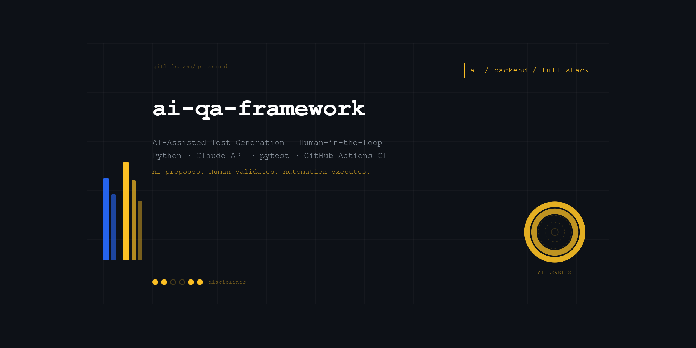

# ai-qa-framework

**AI-Assisted Test Case Generation & Execution Framework**

[](https://github.com/jensenmd/ai-qa-framework/actions/workflows/ci.yml)



---

## What This Is

A working demonstration of AI-assisted QA engineering — not a concept, not a tutorial clone, but a framework I built to show how AI can be integrated into real QA workflows as a **capability multiplier**, not a replacement for human judgment.

This project is built around a core principle:

> **AI proposes. Human validates. Automation executes.**

---

## The Problem This Solves

Manual test case generation is:

- Time-consuming and inconsistent across engineers
- Prone to missing edge cases and coverage gaps
- Difficult to keep current as APIs evolve
- Dependent on individual domain knowledge

AI-assisted generation doesn't eliminate these challenges — but it dramatically accelerates the cycle and surfaces gaps that humans might miss, while keeping the QA engineer firmly in the loop.

---

## How It Works

```
OpenAPI Spec
     │
     ▼
┌─────────────────────────┐
│   Claude AI Analysis    │  ← Analyzes endpoints, methods,
│   (generate_tests.py)   │    data types, auth flows
└─────────────────────────┘
     │
     ▼
┌─────────────────────────┐
│   Structured Test Cases │  ← 10 test cases across 5 categories
│   + Coverage Gaps       │    Coverage gaps identified
│   + Risk Assessment     │    High-risk areas flagged
└─────────────────────────┘
     │
     ▼
┌─────────────────────────┐
│   HUMAN VALIDATION      │  ← QA engineer reviews AI output
│   (The Critical Step)   │    Applies domain knowledge
│                         │    Corrects, adds, removes
└─────────────────────────┘
     │
     ▼
┌─────────────────────────┐
│   pytest Execution      │  ← 16 tests executed against
│   (test_bookings.py)    │    live API
└─────────────────────────┘
     │
     ▼
┌─────────────────────────┐
│   GitHub Actions CI     │  ← Runs automatically on every push
│   + HTML Test Report    │    Full pipeline in the cloud
└─────────────────────────┘
```

---

## Project Structure

```
ai-qa-framework/
├── specs/
│   └── restful-booker-openapi.json    # OpenAPI spec — input to AI
├── generator/
│   └── generate_tests.py              # Claude API integration
├── validation/
│   └── generated_test_cases.json      # AI output — human review layer
├── tests/
│   └── test_bookings.py               # pytest execution suite
├── reports/                           # CI-generated HTML test reports
└── .github/workflows/
    └── ci.yml                         # GitHub Actions pipeline
```

---

## What the AI Generates

For each API endpoint, Claude produces structured test cases covering:

| Category | Description |
|----------|-------------|
| `happy_path` | Valid inputs, expected successful responses |
| `negative` | Invalid inputs, error handling, rejection scenarios |
| `edge_case` | Boundary conditions, unusual but valid inputs |
| `auth` | Authentication flows, token validation, access controls |
| `data_validation` | Field types, required fields, data integrity |

Each test case includes:

- Endpoint and HTTP method
- Preconditions
- Input payload
- Expected status code
- Expected behavior description
- Risk level (high / medium / low)

Additionally, Claude identifies:

- **Coverage gaps** — areas the spec doesn't address
- **High-risk areas** — endpoints or behaviors warranting priority attention

---

## The Human-in-the-Loop Step

This is the most important part of the framework — and the part most AI QA demos skip.

After generation, a QA engineer reviews `validation/generated_test_cases.json` and asks:

1. Are these test cases accurate for this specific system?
2. Are the edge cases realistic given what I know about the domain?
3. Are risk levels correctly assigned based on business impact?
4. What did AI miss that my domain knowledge would catch?
5. Are there compliance, regulatory, or security considerations AI didn't flag?

AI generates fast and broad. Human judgment makes it accurate and meaningful.

---

## Why This Matters

I've been doing enterprise QA for 15+ years — validating ETL pipelines, financial business logic, healthcare data integrity, and REST APIs across complex distributed systems. The judgment required for that work doesn't come from a tool. It comes from understanding why the numbers matter, where systems fail, and what questions to ask when something looks wrong.

AI doesn't replace that judgment. It removes the friction between thinking and output — letting me generate comprehensive test coverage faster, identify gaps I might miss, and focus my attention on the high-risk areas that actually need it.

I was introduced to Ray Kurzweil's work on accelerating intelligence by a mentor in 2008. The integration of AI into knowledge work I watched coming for nearly two decades is here. This framework is how I'm applying it.

---

## Running Locally

**Prerequisites:**
- Python 3.11+
- Anthropic API key

**Setup:**
```bash
git clone https://github.com/jensenmd/ai-qa-framework
cd ai-qa-framework
pip install anthropic python-dotenv requests pytest pytest-html
```

**Create `.env` file:**
```
ANTHROPIC_API_KEY=your-key-here
```

**Generate test cases:**
```bash
python generator/generate_tests.py
```

**Review AI output:**
```
validation/generated_test_cases.json
```

**Execute tests:**
```bash
python -m pytest tests/test_bookings.py -v
```

---

## CI/CD Pipeline

GitHub Actions runs the full pipeline automatically on every push:

1. Install dependencies
2. Generate test cases via Claude API
3. Execute pytest suite against live API
4. Upload HTML test report as artifact

The pipeline requires `ANTHROPIC_API_KEY` set as a GitHub Actions secret.

---

## Test Results

```
16 passed in 8.84s
```

| Test Class | Tests | Status |
|------------|-------|--------|
| TestHealthCheck | 1 | ✅ |
| TestAuthentication | 3 | ✅ |
| TestGetBookings | 5 | ✅ |
| TestCreateBooking | 4 | ✅ |
| TestAICoverageGaps | 3 | ✅ |

---

## Related Projects

| Project | Focus | Stack |
| --- | --- | --- |
| [qa-automation-showcase](https://github.com/jensenmd/qa-automation-showcase) | REST API testing, data validation, CI/CD integration | Python / pytest / Postman / GitHub Actions |
| [restful-booker-qa](https://github.com/jensenmd/restful-booker-qa) | Full-stack layered testing — API + UI automation | Postman / Newman / Playwright / GitHub Actions |
| [pharmacy-spend-etl-qa](https://github.com/jensenmd/pharmacy-spend-etl-qa) | ETL pipeline validation, SQL-driven data integrity testing | Python / pytest / SQLite / pandas |
| **ai-qa-framework** (this repo) | AI-assisted test generation, human-in-the-loop validation | Python / Claude API / pytest / GitHub Actions |

---

## Author

**Michael D. Jensen** — Senior QA Engineer
[LinkedIn](https://linkedin.com/in/michaeljensen-qa) · [GitHub](https://github.com/jensenmd/)
